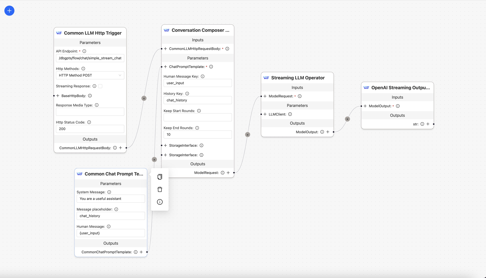

# dbgpts

This repo will contains some data apps、AWEL operators、AWEL workflow templates and agents which build upon DB-GPT.

- [apps](/apps)
- [workflow](/workflow)
- [agents](/agents)
- [operators](/operators)

## Quick Start
At first you need to install [DB-GPT](https://docs.dbgpt.site/docs/quickstart) project.

We will show how to install a dbgpts from the official repository to your local DB-GPT environment.

### Activate python virtual environment

Change to your DB-GPT project directory and run the following command to activate your virtual environment:
```bash
conda activate dbgpt_env
```

Make sure you have installed the required packages:
```bash
pip install poetry
```
### List the available flows
```bash
dbgpt app list-remote

# Those workflow can be installed.
awel-flow-web-info-search(eosphoros/dbgpts/workflow/awel-flow-web-info-search)
awel-flow-simple-streaming-chat(eosphoros/dbgpts/workflow/awel-flow-simple-streaming-chat)
awel-flow-example-chat(eosphoros/dbgpts/workflow/awel-flow-example-chat)
```

### Install a dbgpts from official repository

```bash
dbgpt app install awel-flow-simple-streaming-chat
```

### Restart DB-GPT

Restart DB-GPT to see the new chat flow in the web page.

Like this:

<p align="center">
  
</p>

### Uninstallation

```bash
dbgpt app uninstall awel-flow-simple-streaming-chat
```

### More commands

You can run `dbgpt app --help` to see more commands. The output will be like this:
```bash
Usage: dbgpt app [OPTIONS] COMMAND [ARGS]...

  Manage your apps(dbgpts)

Options:
  --help  Show this message and exit.

Commands:
  install      Install your dbgpts(operators,agents,workflows or apps)
  list-remote  List all installed dbgpts
  uninstall    Uninstall your dbgpts(operators,agents,workflows or apps)
  
```

And you can run `dbgpt repo --help` to see more commands for managing repositories. The output will be like this:

```bash
Usage: dbgpt repo [OPTIONS] COMMAND [ARGS]...

  The repository to install the dbgpts from

Options:
  --help  Show this message and exit.

Commands:
  add     Add a new repo
  list    List all repos
  remove  Remove the specified repo
  update  Update the specified repo
```


## What's the `repo`? 

**A repository is a collection of dbgpts.**

The `dbgpts` can manage by multiple repositories, the official repository is [eosphoros/dbgpts](https://github.com/eosphoros-ai/dbgpts).

And you can add you own repository by `dbgpt repo add --repo <repo_name> --url <repo_url>`, example:
- Your git repo: `dbgpt repo add --repo fangyinc/dbgpts --url https://github.com/fangyinc/dbgpts.git`
- Your local repo: `dbgpt repo add --repo local/dbgpts --url /path/to/your/repo`