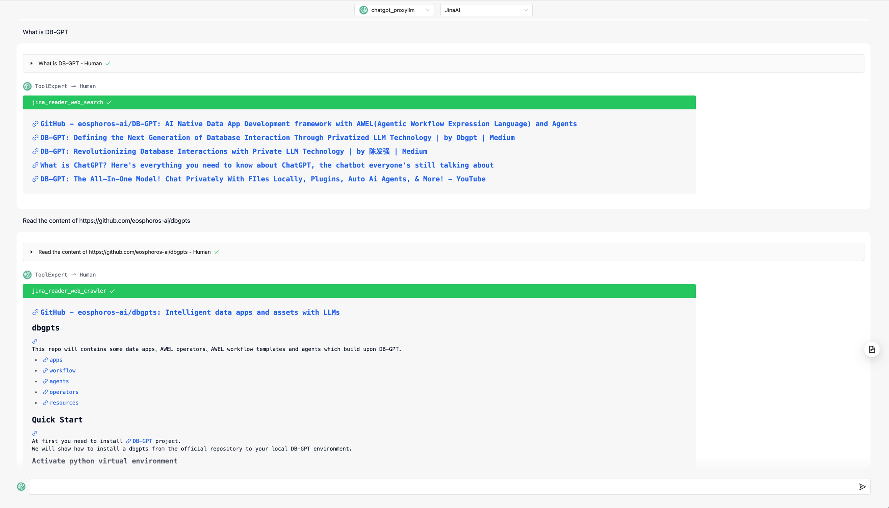

# Jina Web Reader Tool

A DB-GPT tool of [Jina AI Reader](https://github.com/jina-ai/reader).

## Usage

How to use it in DB-GPT?  First, install the tool:

```bash
dbgpt app install jina-web-reader
```

It includes two tools:
- `jina_reader_web_search`: Search web pages using Jina AI Web Search(`s.jina.ai`) API.
- `jina_reader_web_crawler`: Crawl web pages using Jina AI Reader(`r.jina.ai`) API.


Then, create an APP in your DB-GPT web page.


Last, you can use the tool in the APP.




## Configuration

You can configure the tool by setting the environment variables.

### Common Configuration

- `DBGPT_TOOL_JINA_API_TOKEN={your_jina_api_token}`: The Jina AI API token. You can get it from [Jina AI](https://jina.ai/).

### `jina_reader_web_crawler`

- `DBGPT_TOOL_JINA_API_READER_URL=https://r.jina.ai`: The Jina AI Reader API URL. Default is `https://r.jina.ai`.
- `DBGPT_TOOL_JINA_API_READER_TIMEOUT=60`: The Jina AI Reader API timeout. Default is `60`(seconds).

### `jina_reader_web_search`

- `DBGPT_TOOL_JINA_API_SEARCH_URL=https://s.jina.ai`: The Jina AI Web Search API URL. Default is `https://s.jina.ai`.
- `DBGPT_TOOL_JINA_API_SEARCH_TIMEOUT=60`: The Jina AI Web Search API timeout. Default is `60`(seconds).