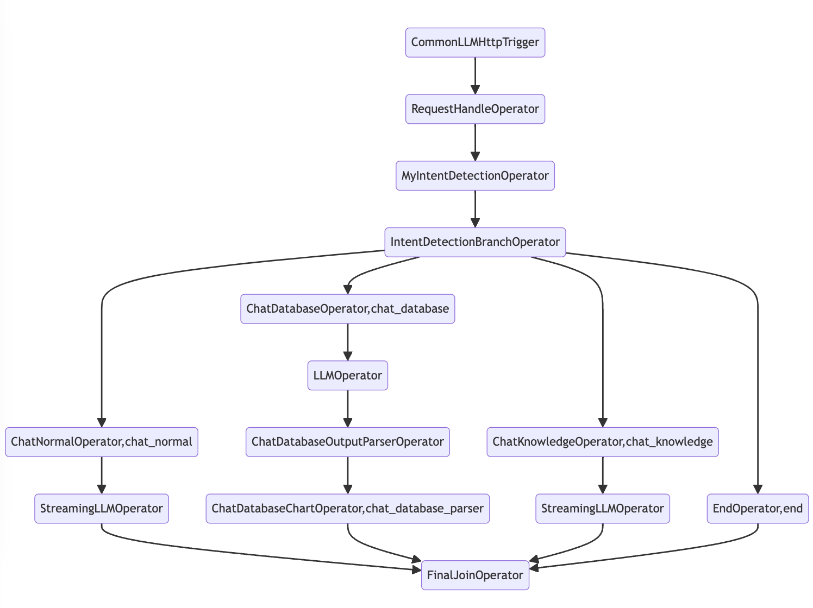

# All In One Entrance

A chatbot based on intent recognition and slot filling as a entrance to all other chatbots.


The graph of DAG is shown below:



## Usage

How to use it in DB-GPT?  First, install the workflow:

```bash
dbgpt app install all-in-one-entrance -U
```

Then restart the DB-GPT server. You will see the `all_in_one_entrance` in the "AWEL Flow" page.