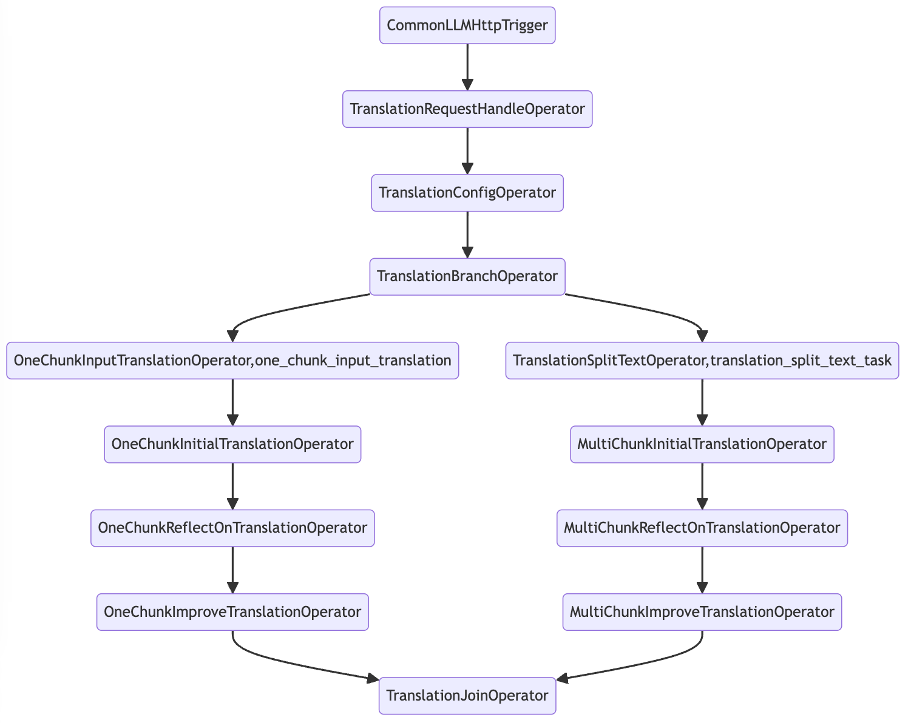
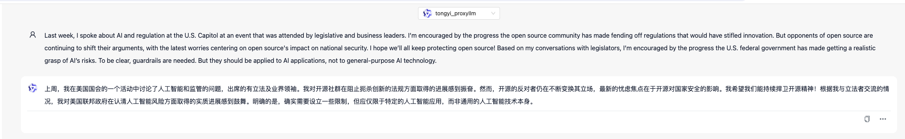

# Translation Agent Of Andrew Ng

Implementation of [Translation Agent](https://github.com/andrewyng/translation-agent) 
with AWEL(Agentic Workflow Expression Language).

The graph of DAG is shown below:



## Usage

How to use it in DB-GPT?  First, install the workflow:

```bash
dbgpt app install andrewyng-translation-agent -U
```

Then restart the DB-GPT server. You will see the `andrewyng_translation_agent` in the "AWEL Flow" page.

Then chat with 'andrewyng_translation_agent'.



## Configuration

It will translate the english text to chinese text by default. You can change the 
source and target language by set environment variables:
- `ANDREWYNG_TRANSLATION_SOURCE_LANG=English`: The source language. Default is `English`.
- `ANDREWYNG_TRANSLATION_TARGET_LANG=Chinese`: The target language. Default is `Chinese`.
- `ANDREWYNG_TRANSLATION_COUNTRY=中国大陆`: The country of the target language. Default is `中国大陆`.
- `ANDREWYNG_TRANSLATION_MAX_TOKENS=1000`: The max tokens of the translation. Default is `1000`. It will split the text into several parts if the length of the text is larger than `1000`.