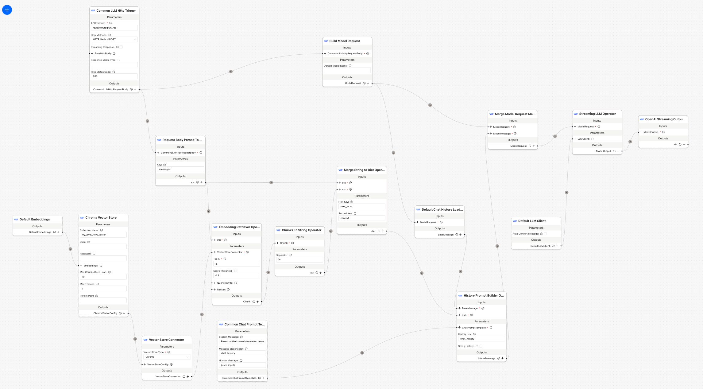

# RAG With Your URL Knowledge Example

<p align="center">
  
</p>

## Use in DB-GPT

First, you should install the `rag-save-url-to-vstore` workflow and load the URL 
content to the vector store according to the 
[README.md](../rag-save-url-to-vstore/README.md).

Then, you can install the `rag-url-knowledge-example` workflow with the following command:

```bash
dbgpt app install rag-url-knowledge-example
```

Wait 10 seconds, then open the web page of DB-GPT, you will see the new AWEL flow in web page.

Run `rag-url-knowledge-example` with the following command:

```bash
dbgpt run flow -n rag_url_knowledge_example \
--model "chatgpt_proxyllm" \
-s \
--messages 'What is AWEL?'
```

**Note**: Please replace the `--model` and `--messages` with your own values.

The output will be like this:
```
You: What is AWEL?
Chat stream started
JSON data: {"model": "chatgpt_proxyllm", "stream": true, "messages": "What is AWEL?", "chat_param": "5e2c5e07-77bc-4c63-8d3d-210694450ee5", "chat_mode": "chat_flow"}
Bot: 
AWEL stands for Agentic Workflow Expression Language, which is a specialized language designed for developing large model applications with intelligent agent workflow. It provides a high level of functionality and flexibility, allowing developers to focus on business logic for Language Model applications without getting bogged down in model and environment intricacies. AWEL features a layered API design architecture for ease of use.
🎉 Chat stream finished, timecost: 3.44 s
```
